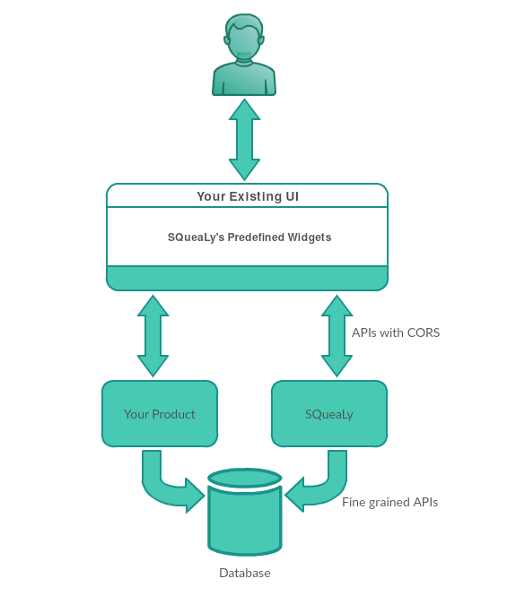
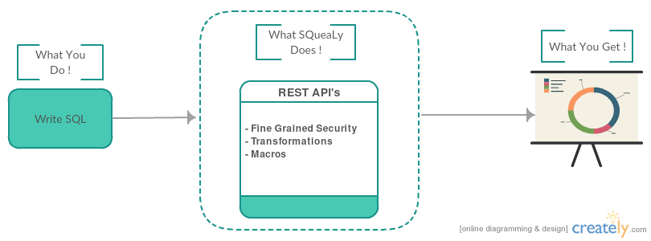

# Fastrack analytics for your business. Use SQueaLy #

[](https://heroku.com/deploy)  
[](https://travis-ci.org/hashedin/squealy)
[]()

SQueaLy is an open-source, self-deployable application for developers. It is a micro service for business intelligence and analytics which uses SQL queries to generate reporting APIs with fine-grained security. It gives you the power to analyze your organizational data in an environment that is completely owned by you. Hence, making it the most suitable solution for generating charts and reports out of sensitive data.

<p align="center">
  
</p>

## When to use SQueaLy

**When you want charts and reports but don't want to build the APIs**  

Using SQueaLy, creating APIs for your reports/charts and visualizing the output is super quick. Just write the query to fetch the data from your database and use the SQueaLy's authoring interface to visualize the output. Once satisfied, give your users the permission to view/edit the report and share the URL of your report. That's it!

<p align="center">
  
</p>

**When you want fine grained security in your reporting APIs**  

You can provide not only chart level view permissions but also user/parameter level permissions. To make that one liner straighforward, consider the following use case.  
You have a chain of hotels based on multiple locations. You create 5 reports which are to be viewed by the managers of each hotel but you don't want the manager of one location to view the report of the hotels not managed by him.  
Now if you write this logic in your own code, it is going to take a lot of time but using SQueLy, this can be done in seconds.

**When you want scheduled emails embedded with reports**  

SQueaLy also provides you the interface to schedule emails with reports embedded in it. All you have to do is
- Group the reports you want to send in the email
- Write a [cron expression](http://docwiki.embarcadero.com/Connect/en/Writing_a_CRON_Expression) to schedule the email

Not just that. For white labling, you can even customize the look and feel of the email message by providing the HTML for it 


## Key Features
**One-Click Deploy to Heroku**  

Just click on the 'deploy-to-Heroku' button, login to your Heroku account, enter environment variables and the application will be deployed under your account and domain.

**JSFiddle like interface to test and visualize the output**  
SQueaLy provides you a user-friendly editor like interface to test and debug your queries/APIs.

**Your data is always secure**  

All the database credentials and secret keys are stored as environment variables in your own server architecture (Heroku).

**More than just SQL**  

SQueaLy uses JinjaSQL behind the scenes which gives you power to **use JINJA inside the SQL query**. For more details, check out [JinjaSQL](https://github.com/hashedin/jinjasql/).

**Permission based model**  

SQueaLy provides you the ability to assign view/edit permission to any user for each chart/report. 

**Multiple Databases**  

You can set up multiple database connections and specify the database to use while generating the chart/report.

**Scheduled emails embedded with reports**  

SQueaLy comes with email solutions as well. You can schedule emails embedded with the charts/reports you had created by just writing a [cron expression](http://docwiki.embarcadero.com/Connect/en/Writing_a_CRON_Expression)  

## Requirements

1. An account on [Heroku](https://www.heroku.com/)
2. A database accessible from the internet

## Database Support

Athena, Redshift, Mysql, Postgres, Sqlite,  

## Getting started
- Click on the 'Deploy-to-Heroku' button on the [top](#squealy) of this documentation.
- Login/signup to your Heroku account.
- Enter the environment variables and click deploy (Make sure to note the admin credentials entered at this step).

The app is deployed and the first chart has already been created for you. Hit the **Run** button and you can see the data/visualization in the results section.

## Usage

### Managing Permissions (Chart-level Authorization)
SQueaLy uses Django's default permission model for managing chart level authorization.
Everytime a new chart is created, 2 permissions are added in the backend automatically corresponding to view and edit mode access.

For example, if the chart is named as **'foo'** then, permissions **'can-view-foo'** and **'can-edit-foo'** are added automatically.

The administrator just needs to add the required permissions to users or groups from the Django admin panel. ( located at https://<your_domain>/admin )

Also, there are two other high-level permissions - **can-add-chart** and **can-delete-chart** that are required for creation and deletion of charts, respectively.

For non-Django folks: By default, the admin user has all permissions.

### Using the APIs

SQueaLy generates APIs in real-time corresponding to each chart. Just hit the API corresponding to your chart_url,
**NOTE:** The chart_url is the chart name in lower case, replacing spaced by hyphen ('-')

``` 
<your_domain>/squealy/<chart_url>?<param_name>=<value>&<param_name>=<value>
```
This API will return the data in the format that is compatible with **GoogleCharts**.

### Query Parameterization
To add a parameter, you need to use the keyword object "**params**" inside your jinja template.
For example, to include a parameter named **foo**, 

``` sql
SELECT * from some_table
WHERE some_value = {{params.foo}};
```

In the view mode, these parameter values would be extracted from the filters, but if you are using the API, then you need to pass these parameters in the url like this:
```
<your_domain>/squealy/<chart_url>?<param_name>=<value>&<param_name>=<value>
```

### User-level Authorization
SQueaLy allows you to use user parameters inside the query template, the values of which would be extracted from the logged in user while running the query.

Use the keyword object "**user**" in the jinja template to access the **request.user** object provided by Django. For further details, checkout [Django User Objects](https://docs.djangoproject.com/en/1.10/topics/auth/default/#user-objects).

For example, 

``` sql
--- To see the bookings of the current user only.
SELECT bookings from bookings_table
WHERE some_value = {{params.foo}}
AND name = {{user.username}}
```

### Dropdown Filter APIs
SQueaLy provides Filter APIs to add Dropdown options. You just need to write the query to get the data from the database.
SQueaLy provides **can_edit** permission for filters. If user does not have **can_edit** permission, API will be available
as a dropdown option only while adding parameters in the chart.

SQueaLy supports Parameterized filters also.
For Example: you have two filters Country and City and you want to show all cities for selected Country.

Query for Country
``` sql
SELECT Country FROM some_table;
```

Query for City
``` sql
SELECT City FROM some_table WHERE Country={{params.country}};
```

**Note:** Order plays an important role for Parameterized filter. Parameterized filter should render after it's parameters.
For above example, City filter should render after Country filter.


### Validations
With every chart, you can attach another SQL query that would validate the API. The API would return a 403 Forbidden response, if the validation query returns no rows.

### Transformations 
SQueaLy provides some transformation functions for processing the data after executing the query. Currently, 3 transformations are supported:

- **Transpose:** This would return the transpose of the data table that is returned from the query.
- **Merge:** This merges two columns into a single column and distributes the data accordingly.
- **Split:** This is an alternative to pivoting the table. Chose a column to split and a metric column that is to be distributed.

### JWT Authentication
SQueaLy provides a mechanism to log in a user via an access token that would help in sharing some other application's user-base with squealy without the need to import the users in SQueaLy database.
- **JWT_KEY** - This is setup in the environment while deploying SQueaLy app. This is the private key that is shared between squealy and the other application which is directing users to SQueaLy. 
- **Token encoding**: Use the above key to create a jwt token in your application with the following payload:
    ``` js
    {
    "username": "foo", //Squealy assumes the authenticity of this user is handled by the directing application.
    
    "groups": ["g1", "g2", "g3"] //List of Django permission groups that this user belongs to.
    }
    ```
- **Sending the token**: You can send this token as a url parameter in a GET request or as a body parameter in a POST request to any of the squealy APIs. SQueaLy would ensure to login the user before handling the request.


# Development
## Backend setup
**Activate a virtual environment**
```
virtualenv venv
source venv/bin/activate
```

**Installing dependencies**
```
pip install -r requirements.txt
```
**Database Setup**
SQuealy needs a postgres database to run. Create a database and a user with **Create DB** role. (To run test cases). Use the following command on psql to grant this access to a user:
```
ALTER USER username CREATEDB;
```
Note the URL of this database for use in the next step. The URL will be of the following format:
```
<mysql/postgres>://<username>:<password>@<host>:<port>/<database>
```
For further help regarding postgres setup, click on one of the following links:
- [For Mac OSX.](https://www.codementor.io/devops/tutorial/getting-started-postgresql-server-mac-osx)
- [For Linux.](http://www.yolinux.com/TUTORIALS/LinuxTutorialPostgreSQL.html)

**Setting up environment variables**
Before running the server, make sure to set the following environment variables using this command:
```
export KEY=VALUE
```
- DATABASE_URL - This is the database that will be used by squealy internally for user management.
- QUERY_DB - This is the DB used to run the queries on. Enter comma separated URLs for multiple DBs.
- ADMIN_USERNAME - This is the default admin's username that would be created with the first migration command.
- ADMIN_PASS - This is the password for the default admin user.
- JWT_KEY - This is the shared private key that will be used to decode the JWT token. This is required for optionally enabling JWT Authentication mechanism that would enable the user to login via an access token parameter in the url or request body. For more information refer [above](#jwt-authentication). 

**Running the migrations**
```
python manage.py migrate
```

**Running the server**
```
python manage.py runserver
```

**Running test cases**
```
python manage.py test
```

## Frontend setup

**Installing dependencies**
```
cd squealy/squealy-web
npm install
```
**Running the development server**
```
npm start
```
**Running test suites**
```
npm test
```
**Getting production build**
```
npm run build
```

## Copyright
(c) 2017 HashedIn Technologies Pvt. Ltd.
