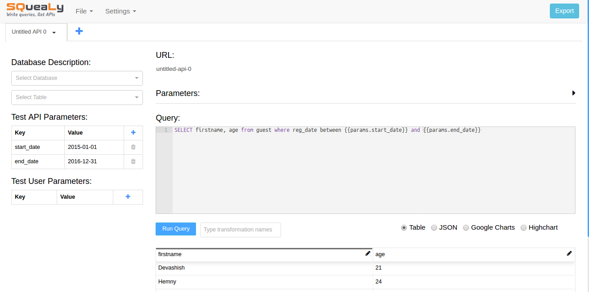
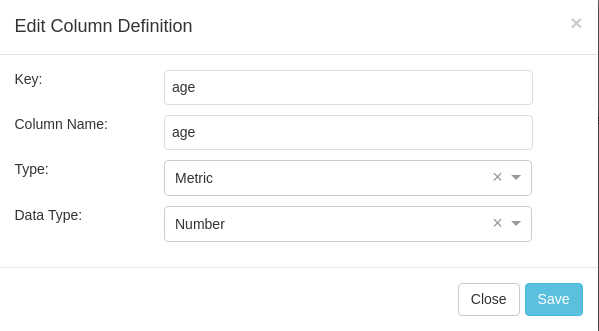
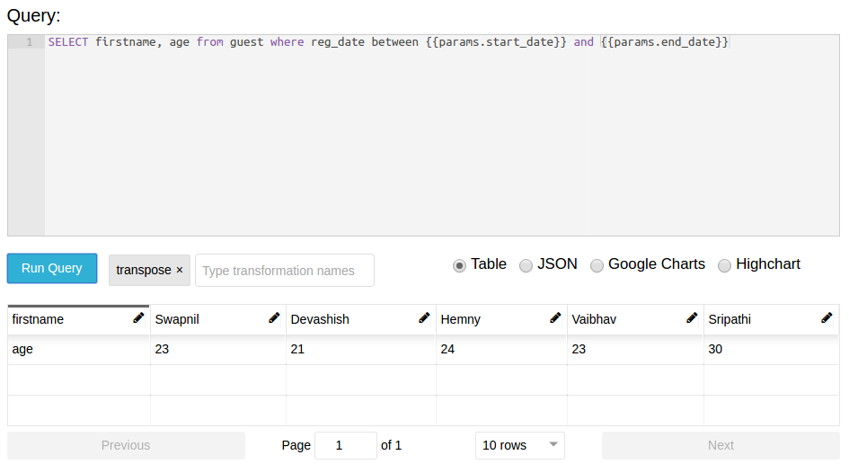
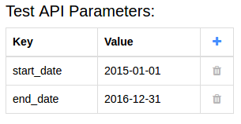
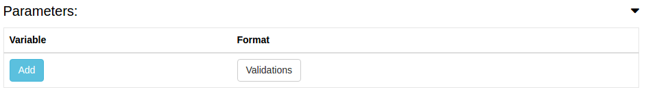
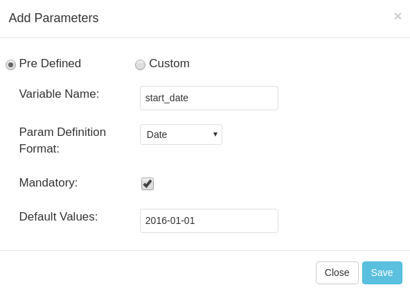
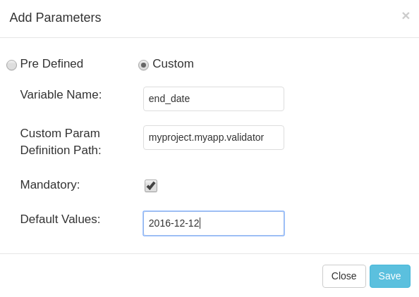
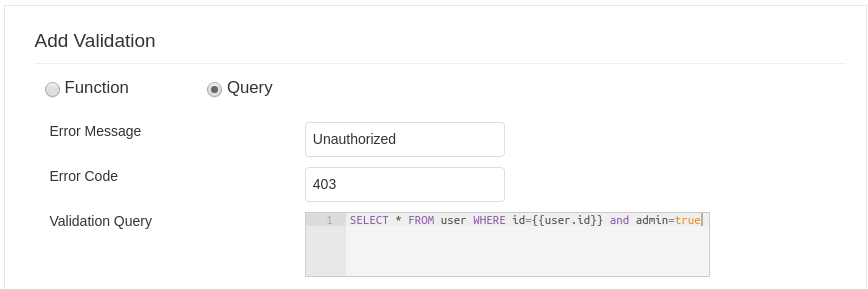
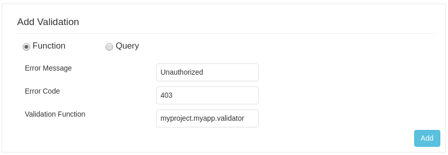
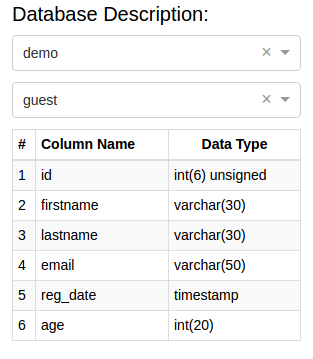

************************************
Welcome to squealy's documentation!
************************************

About Squealy
##############
Squealy is a django app for auto-generating reporting APIs. All configurations are passed through a single **.yml** file, which includes sql queries to fetch report data for each API.

There is support for auto-formatting the data to google charts and highcharts format for quick dashboard integration.

Squealy also supports sql templates based on `jinjasql <https://github.com/hashedin/jinjasql>`_, hence, complex parameterized sql queries can be written.

Squealy-generated APIs are based on `Django Rest Framework <http://www.django-rest-framework.org/>`_. All APIs can be easily configured to use the authentication classes provided by django rest framework.

Squealy supports parameter level and API level validation/authorization as well.

Squealy is highly customizable.

Installation Instructions
##########################

From pip (recommended):

.. code-block:: console
		
     pip install squealy

From the source:

.. code-block:: console
     
     git clone https://github.com/hashedin/squealy
     cd squealy
     sudo python setup.py install
|
|
Minimalistic Usage
###################
Since Squealy is based on django rest framework, you can create class based ApiViews easily.

.. code-block:: python
    
    from squealy.views import SqlApiView
    
    class DatabaseTableReport(SqlApiView):
        query = "select name, sql from sqlite_master limit {{params.limit}};"

Just this much and your reporting API is ready for use.

Getting Started with YAML
##########################
Building class based APIs is cool, but squealy provides a better way to create multiple APIs just by passing one configuration file.

Lets build some simple APIs that fetch some data from database via SQL query.

1. **Database Connection**: Squealy APIs can use any of the connections made in settings.py, via **connection_name** property which defaults to the **default** connection. For now, lets assume that the default connection is setup in settings.py.

2. **YAML file:** Create a .yml file anywhere in your project providing the API configurations. The structure of this file is defined in detail below. For now, lets start with a minimal configuration to create 2 APIs.

.. code-block:: yaml
 
 ---
 id: api1
 url: api1
 query: >
    select name, sql from sqlite_master limit 5;
 ---
 id: api2
 url: api2

 query: >
    select name, sql from sqlite_master limit {{params.limit}};
 ---

3. **APIs Generation:** Use the ApiGenerator class to generate the squealy APIs inside your project's **urls.py**.

.. code-block:: python

 from squealy.apigenerator import ApiGenerator
 from os.path import dirname, abspath, join

 # Generate the file path to your *.yml file
 YAML_ROOT = join(dirname(abspath(__file__)), "yaml")
 file_path = join(YAML_ROOT, "apis.yaml")

 # Generate url objects
 squealy_urls = ApiGenerator.generate_urls_from_yaml(file_path)

 urlpatterns = [
     url(r'^squealy/', include(squealy_urls)),
 ]

4. **Test the APIs:**
   
 Run the server:

.. code-block:: console
 
    python manage.py runserver

 

|

| That's it! you can now test your APIs in your browser at the following urls:
| (assuming the server running on port 8000)

.. code-block:

  http://localhost:8000/squealy/api1
  http://localhost:8000/squealy/api2/?limit=10

Yaml Configuration
##################
The .yml file serves as the sole input for all sorts of API configurations.
The .yml file can have multiple docs (or, APIs) separated by three dashes (- - -). 

Following are the supported arguments in detail.
The mandatory arguments are appended with an asterisk(*) sign.

|id|
****

.. |id| raw:: html

   id*

This is a unique id given to each API. It is used internally by squealy for creating ApiView classes.

|url|
*****

.. |url| raw:: html

   url*

This is the url endpoint to the API. **Do not prepend the url with a '/'.**

|query|
*******

.. |query| raw:: html

   query*

This is the SQL query, or, more precisely, a `jinjasql <https://github.com/hashedin/jinjasql>`_ template with parameters bind in the query. The parameters can be extracted from the session or the GET request. The parameters are explained in detail later below.

parameters
**********

This is a dictionary with parameter names as keys and value is further a dictionary with parameter config. The different parameter configurations are listed below.

.. code-block:: yaml

 parameters:
            param1:
                 type: string
                 default_value: somestring
                 optional: True [False by default]
            param2:
                 type: date
                 format: "DD/MM/YYYY"
            param3:
                 type: datetime
                 format: "DD/MM/YYYY HH:mm:ss"

|
 
 There are some in-buit macros supported:
  - Date - 'today', 'current_day', 'tomorrow', 'next_day'
  - Datetime - 'today', 'now' 

 You can extend the **squealy.parameters.Parameter** class and implement the    **to_internal(self, value)** function to create your own parameter type as well.In the yaml file, just give the function path like, 'myapp.somepackage.MyCustomParameter'

validations
***********

This is a very important and useful feature for API authorization. This is a list of validations which would run with every API call. If anyone of these validations return False, the API would return an error code and the request will be unauthorized.

 The **validation_function** attribute is a path to the function that is to be used     to run the validation. This can be a **user defined function** or one of the functions  defined in the **'squealy.validators'** module.

 The validation_function must of the following signature:
  Boolean foo(api, params, user, ...any_other_args):

 The **api** is the complete ApiView object, **params** contains the parameter values passes through the url, **user** is the request.user object which can be used to extract session data.

 There is a pre-defined function 'squealy.validators.run_query' which takes a sql query and if that query retutrns any rows, then the validation is passed.

.. code-block:: yaml

   validations:
    -
        error_message: "Invalid parameter: name"
        error_code: 403
        validation_function:
                            name: 'squealy.validators.run_query'
                            kwargs:
                                   query: >
                                            select name from sqlite_master where {{params.name}} in ("django_migrations");
    -
        error_message: "Custom Validation Failed"
        error_code: 403
        validation_function:
                            name: 'exampleapp.custom_validators.validate_user_id'

authentication_classes
**********************

This is a list of django rest framework `authentication classes <http://www.django-rest-framework.org/api-guide/authentication/>`_ which would be applied to the generated APIs.

.. code-block:: yaml

   authentication_classes:
     - SessionAuthentication
     - BasicAuthentication
     - TokenAuthentication

permission_classes
******************

This is a list of django rest framework permission classes which would be applied to the generated APIs.

.. code-block:: yaml

   permission_classes:
     - IsAuthenticated

transformations
***************

Squealy supports some transformations which can be very helpful to transform the response data. Below are the supported transformations:

 - **transpose**: This transposes the output table.
 - **merge**: merge two columns into a new column.
 - **split**: pivot the table at a column and re-arrange the metric column accordingly.

  For split transform, it is mandatory to define the columns as well.

.. code-block:: yaml

 columns:
        name:
            type: "dimension"
        sql:
            type: "dimension"
        num:
            type: "metric"

 transformations:
          -
            name: "transpose"
          -
            name: "split"
            kwargs:
                   pivot_column: "name"
          -
            name: "merge"
            kwargs: 
                   columns_to_merge:
                                    - "sql"
                                    - "num"
                   new_column_name: "merged_column"
|

 You can create your **custom transformations** as well. Just extend the 'squealy.tranformers.TableTransformer' class and implement the **transform(self, table)**. In the yaml file inside 'name' key, use the path to your custom transformer class, like 'myapp.somepackage.MyCustomTransformer'

format
******

The default format is 'SimpleFormatter', which returns the data in json as a 2-D array. Other supporter formats are:

  - 'GoogleChartsFormatter' : for google charts
  - 'HighchartsFormatter': for HighCharts

.. code-block:: yaml

 format: 'GoogleChartsFormatter'

|

 You can create your **custom formatters** as well. Just extend the 'squealy.formatters.Formatter' class and implement the **format(self, table)**. In the yaml file in 'format' key, use the path to your custom formatter class, like 'myapp.somepackage.MyCustomFormatter'

Squealy Authoring Interface
############################

Squealy comes with an authoring interface using which you can create, test and debug multiple APIs through a single page application. Here is a detailed description of all the features:

* Support to view the response in various formats like tabular/JSON/Google Charts/Highcharts.

* Query response visualization using Google Charts charting library.

* URL name generation and customization for an API.

SQL Editor
**********

We provide an editor with syntax highlighting to write the sql query. Squealy uses the ACE editor for this feature which has support for syntax highlighting and hence makes it easier to write complex queries.

Query Response Section
***********************

Just below the sql editor, we provide a section where you can view the response of the query. This response could be the data retrieved from the database or it could be a descriptive error.

Response visualization in multiple formats
*******************************************

Using this feature the you can view the response in multiple formats. As of now, we provide the following four formats:

* **Table**- Selecting this format you can view the response in a paginated table. This format can be very handy when you want to apply transformations or want to view the effects of the applied transformations.

* **JSON**- Selecting this format you can view the response in JSON format. 

* **Google Chart**- This format displays the response in a structure desired by Google Chart charting library.

* **Highcharts**- This format displays the response in a structure desired by Highcharts charting library.

Customizing the query response
******************************

Squealy provides you the flexibility to customize the column names, type(metric/dimension) and data type(string/date/datetime/number). To use this feature, select table format from the format selection section and click on the edit icon on the column which you want to customize. This will launch a modal where you can customize the columns.

Transformations
****************

To apply transformation, we provide a multi-select input field from where you can select a transformation and the columns on which the transformations are to be applied.

* In order to apply a transformation, **select table as the response format**. 
* The go to the transformations dropdown and select a transformation. In case of transpose, you will not have to select a column but in split or merge that has to be done.
* In case of split, select a column to split from the modal generated and a column which is the metric in current response.
* In case of merge, just select the columns to be merged from the generated modal.

Once you are done which selecting and customizing the transformation, hit the run query button just below the SQL editor.

Mocking the API parameters
***************************

Since the queries will be having parameters which will be retrieved from the URL/session in the real world scenario, we provide a tabular section where you can insert the values for these parameters for testing purposes.

You do not have to write the parameter names as Squealy is smart enough to identify the parameters. The parameters will keep on getting added to the parameters section as you write the query.

Validating the format of API parameters
****************************************

There are two ways of validating the API parameter format. The first one is the pre defined way which Squealy already has. The other one is to define you custom parameter format and give the path of the function which validates the format.

Using predefined formats
-------------------------

Just above the SQL editor, you can define the desired format for all the parameters.  The supported formats are **date, datetime, number and string**.

Using custom parameter formats
-------------------------------

In the Add parameter modal enter the name of the parameter and define the path of the function which validates the parameter.

Validating the API parameters
******************************

Just next to the add parameter button above the sql editor, there is a button clicking on which launches a modal. In this modal you can define the way the API parameters are going to be validated. This feature also comes in two flavors. One way is to write another SQL query which will validate the parameters and the other way is to write a python function and provide its path. Let us discuss these in more detail.

Validation using SQL query
---------------------------

From the launched modal select the query radio button. 

In the error message field enter the error message that you want to show in case the validation fails.

In the error code field, enter the error code which you want in the response in case the validation fails.

In the query field, write the SQL query which will validate the parameters. You can even access and use the API parameters here.

Validation using Custom python functions
-----------------------------------------

From the launched modal, select the function radio button. The first two fields are same as the sql query validation. In the validation function field, enter the path considering your app as the root path.

Getting Table descriptions
***************************

Every developer who has written SQL queries must have faced the problem of viewing the description of the tables to be used in the query again and again while designing the query. To solve this problem, Squealy provides a feature where you can select a database and tables from the selected database. On selecting the tables, you will get a full description of the table just next to the SQL editor.

**Note:** In order to use this feature, you need to define the db credentials in the DATABASES parameter in settings.py.

